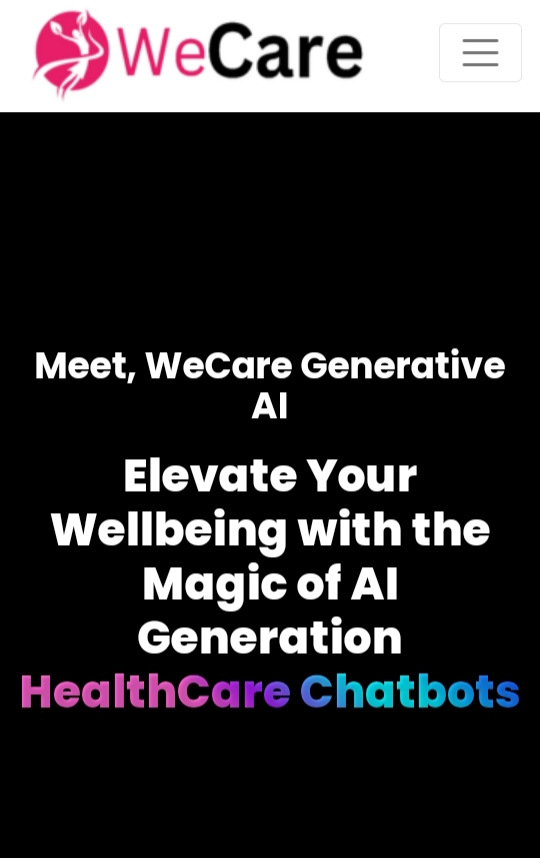
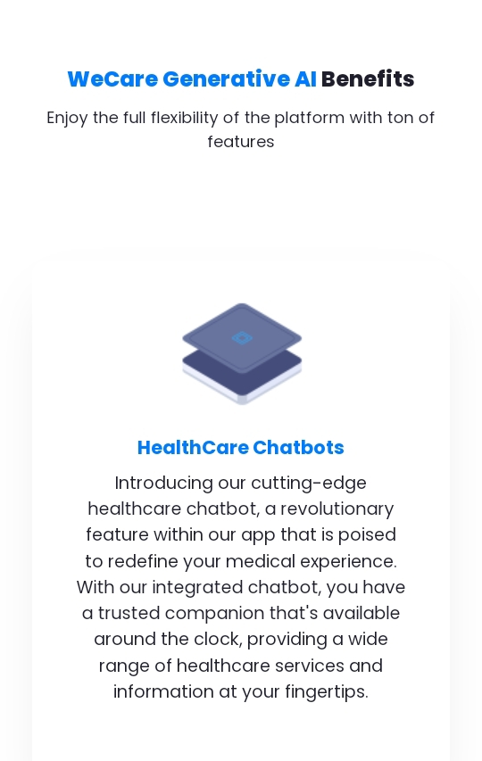
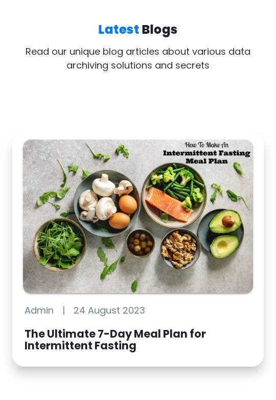
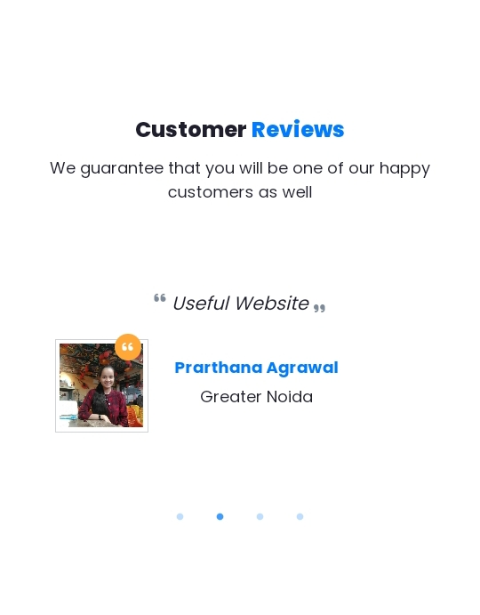
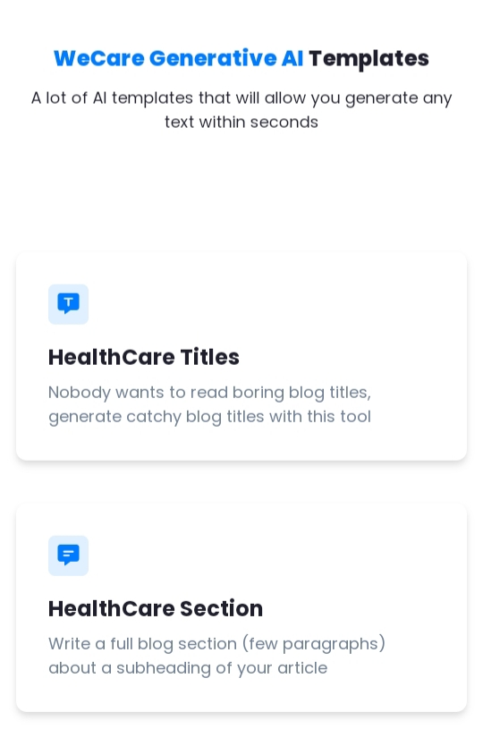

## LearnNowX-Ideathon

# WeCare Generative AI
WeCare is to utilize advanced artificial intelligence techniques to create and simulate various healthcare-related data and scenarios. It aims to assist medical professionals in tasks such as generating medical images, personalized treatment plans, synthetic patient data, and predictive modeling. By harnessing the power of generative models, these apps have the potential to enhance medical research, diagnostics, treatment planning, and education within the healthcare industry.

## Overview
This generative AI healthcare app employs cutting-edge artificial intelligence to produce women healthcare-oriented content and simulations. It leverages generative models to create medical images, patient data, treatment plans, and more, supporting medical practitioners in diagnosis, research, and personalized care. By simulating various healthcare scenarios, these apps contribute to improved medical understanding, training, and decision-making, ushering in a new era of innovation in healthcare.

# Problem Statement :
Fear of the stigma associated with women health services has always been one of the reasons why women avoid making use of such services. This stigma imposes a great deal of mental stress, fear, and depression on patients and causes delays in the diagnosis and treatment of their conditions.

Developing a generative AI health app holds immense potential to revolutionize the way women access and engage with healthcare information. They need to be served with a personalized and comprehensive health companion, providing them with tailored insights into their well-being.

Through this app, we aim at solving the limitations of traditional content creation methods by leveraging advanced AI tehniques ensuring that the generated content by the app aligns with the user’s desired style and context. Our app has the potential to enhance health education, accessibility to information and overall well-being in an empowering manner.

## Objectives :  :notebook_with_decorative_cover:	
- Medical Imaging Generation
- Personalized Treatment Plans
- Medical Text Generation
- Healthcare blogs for suggestions, advice and consultancies
- Virtual Patient Simulation
- ChatBot Integration
- AI Chat Support
- Template Crafting
- 2FA Account Protection
- Dedicated Dashboard for Women Health Services

# Solution :  :key
We aim at solving the limitations of traditional content creation methods by leveraging advanced AI tehniques ensuring that the generated content by the app aligns with the user’s desired style and context. Our app has the potential to enhance health education, accessibility to information and overall well-being in an empowering manner.

## Product 
1. HealthCare Generative AI Web App + Android App
2. AI Tool Kit For Content Creation
3. Woemn Health App

## Challenges :  	:notebook_with_decorative_cover:
- Balancing AI assistance with content creators' creative input.
- Maintaining content quality and authenticity in automated processes.
- Integrating AI into existing content creation workflows.
- Data privacy and ethical considerations.
- Accurate understanding of user preferences and interests.
- Monitoring and evaluating AI performance.

## Tools and Technology Used:

## Business Model / StartUp Potential  	:moneybag:
Subscription-Based Model: Offer tiered subscription plans for users, providing access to different levels of features such as personalized health assessments, ongoing monitoring, virtual consultations with healthcare professionals, and exclusive educational content.
Freemium with In-App Purchases: Provide a free version of the platform with basic health assessment capabilities, and offer premium add-ons or advanced features for purchase, such as in-depth diagnostic reports, personalized treatment plans, and unlimited access to generative AI health content.
B2B Partnership Model: Collaborate with healthcare providers, clinics, and hospitals to offer a white-label version of the platform as part of their patient care services. Provide data analytics tools and AI-powered insights to healthcare organizations for optimizing patient outcomes and resource allocation.
Data Monetization and Research: Aggregate anonymized and consented user health data to generate valuable insights for pharmaceutical companies, research institutions, and public health agencies. Offer paid access to aggregated, anonymized data sets for research purposes while ensuring strict data privacy standards.

1. Pay-per-Use Model:
Implement a pay-per-use model where users pay a small fee for each content generation request. This approach allows users to pay only for the content they need, making it cost-effective for occasional users or small-scale content generation requirements.

2. API Access and Integration:
Offer an API (Application Programming Interface) for developers and businesses to integrate the content generation tool into their own applications, websites, or platforms. Charge a usage-based fee for API access, allowing developers to incorporate content generation functionality into their products.

3. Data Insights and Analytics:
Provide advanced data insights and analytics as an add-on service. Users can opt to receive detailed reports on content performance, engagement metrics, and audience feedback to refine their content strategies. This data-driven service can be offered as a premium feature or as part of an enhanced subscription tier.

4. Sponsored Content:
Partner with brands or businesses interested in promoting their products or services through generated content. Offer sponsored content slots within the generated output, where advertisers can insert their messages in a non-intrusive manner. This can provide an additional revenue stream while offering relevant content to users.

5. Content Creation Services:
Offer content creation services as an additional service to users who require professional-grade content for marketing campaigns or other purposes. Users can request custom content generated by human writers trained to mimic specific writing styles and tones.

6. In-App Purchases:
Offer in-app purchases for additional features, templates, or content styles that users can use to customize their generated content. These microtransactions can provide users with more options while generating additional revenue for the tool.

### ScreenShots of WeCare
<pre>
     
</pre>
### Contributors

- Aman Gupta
- Shashank Kumar
- Richa Agrawal
- Prarthana Agrawal
- Prakhar Singh

